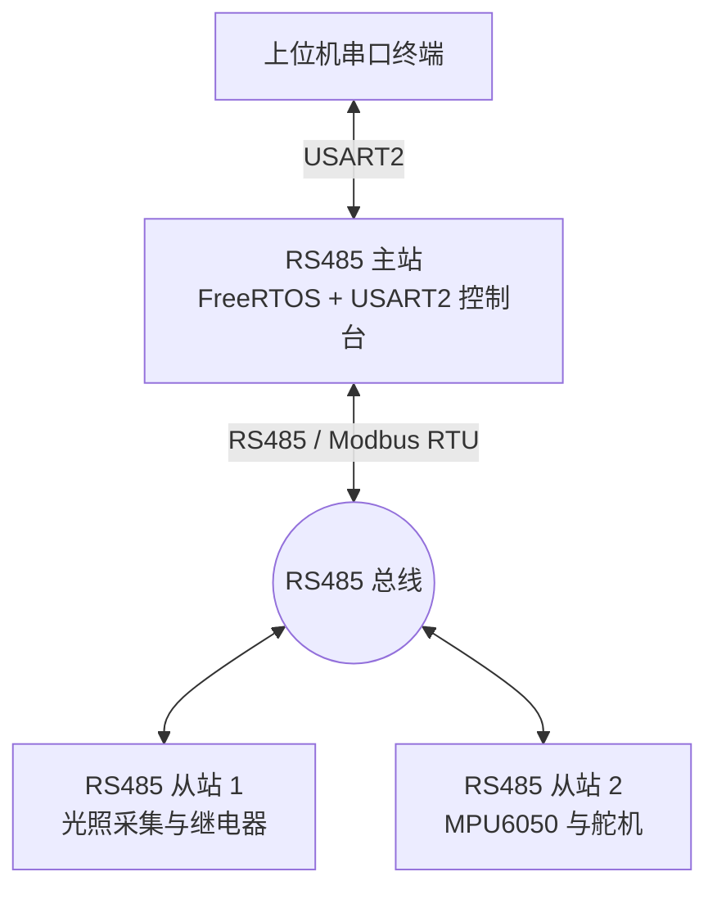
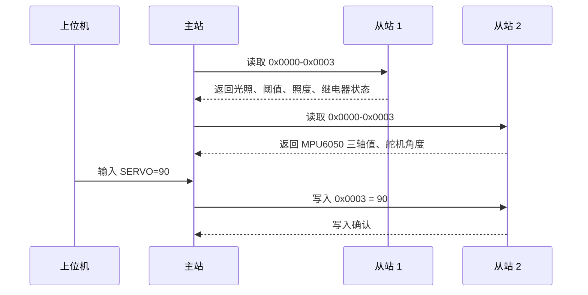

# Modbus 现场控制系统

基于 STM32F103、RS485 和 Modbus RTU 的三节点现场控制系统。主站使用 FreeRTOS 统一调度，从站分别负责光照控制与姿态/舵机控制。

## 目录

- [项目概述](#项目概述)
- [系统结构](#系统结构)
- [核心特性](#核心特性)
- [节点职责](#节点职责)
- [通信流程](#通信流程)
- [寄存器定义](#寄存器定义)
- [项目结构](#项目结构)
- [相关文档](#相关文档)

## 项目概述

本仓库包含三个独立工程：一个 RS485 主站和两个 RS485 从站。主站负责轮询、命令解析和诊断输出，从站负责各自的传感、控制与寄存器映射。
实物图：
串口输出数据结果：

## 系统结构

## 核心特性

- 主站采用 FreeRTOS 组织轮询状态机。
- 通信统一使用 Modbus RTU。
- 从站 1 提供光照采集、阈值控制和继电器输出。
- 从站 2 提供 MPU6050 采集和舵机 PWM 控制。
- 主站支持 USART2 控制台命令。

## 节点职责

| 节点 | 地址 | 角色 | 主要外设 | 主要职责 |
|---|---|---|---|---|
| [RS485_Master](./RS485_Master/) | 无 | 主站 | USART1、USART2、FreeRTOS | 轮询从站、解析命令、汇总诊断信息 |
| [RS485_Slave1](./RS485_Slave1/) | 0x01 | 从站 | USART1、ADC、GPIO | 光照采集、阈值判断、继电器控制 |
| [RS485_Slave2](./RS485_Slave2/) | 0x02 | 从站 | USART1、I2C、TIM3 | MPU6050 采集、舵机角度控制 |

## 通信流程

## 寄存器定义

### 从站 1（0x01）

| 地址 | 类型 | 说明 |
|---|---|---|
| 0x0000 | 只读 | ADC 原始值 |
| 0x0001 | 读写 | 光照阈值 |
| 0x0002 | 只读 | 当前照度值 |
| 0x0003 | 只读 | 继电器状态 |

### 从站 2（0x02）

| 地址 | 类型 | 说明 |
|---|---|---|
| 0x0000 | 只读 | MPU6050 X 轴原始值 |
| 0x0001 | 只读 | MPU6050 Y 轴原始值 |
| 0x0002 | 只读 | MPU6050 Z 轴原始值 |
| 0x0003 | 读写 | 舵机角度（0-180） |

## 项目结构

| 目录 | 说明 |
|---|---|
| [RS485_Master](./RS485_Master/) | 主站工程 |
| [RS485_Slave1](./RS485_Slave1/) | 从站 1 工程 |
| [RS485_Slave2](./RS485_Slave2/) | 从站 2 工程 |

## 相关文档

- [主站说明](./RS485_Master/README.md)
- [从站 1 说明](./RS485_Slave1/README.md)
- [从站 2 说明](./RS485_Slave2/README.md)
